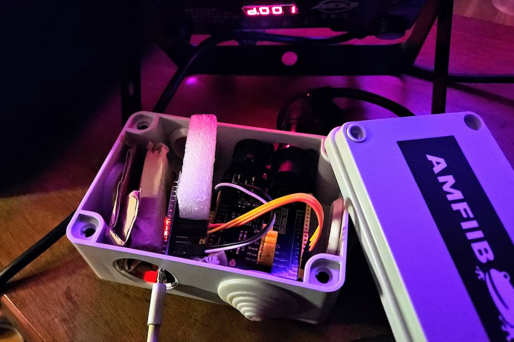

# SparkWeaver ESP

ESP32 app to run [SparkWeaver](https://github.com/rzuppur/sparkweaver.core) DMX lighting node setups.

---

## You need

- ESP32 development board.
- a DMX board or build your own using a chip like the MAX485. Inexpensive DMX shields (like [Keyestudio KS0529](https://wiki.keyestudio.com/KS0529_Keyestudio_DMX%EF%BC%88RDM%EF%BC%89Shield)) with XLR connectors already attached are the easiest option. There isn’t one definitive guide to recommend, so please search the web to find more info relevant to your use case.
- connect ESP32 to DMX board `enable`, `RX` and `TX` pins. Defaults are `4`, `16`, `17`. Connect 3.3 or 5 V power to the DMX board.
- install [PlatformIO](https://platformio.org/) to build and flash the project to your device.
- your own copy of [SparkWeaver Web](https://github.com/rzuppur/sparkweaver.web) or use the hosted version at [dmx.reinozuppur.com](https://dmx.reinozuppur.com/) to control the device remotely. Default bluetooth pairing password is 654321.

---

## License

MIT License

SparkWeaver Copyright (c) 2025 Reino Zuppur

Permission is hereby granted, free of charge, to any person obtaining a copy
of this software and associated documentation files (the "Software"), to deal
in the Software without restriction, including without limitation the rights
to use, copy, modify, merge, publish, distribute, sublicense, and/or sell
copies of the Software, and to permit persons to whom the Software is
furnished to do so, subject to the following conditions:

The above copyright notice and this permission notice shall be included in all
copies or substantial portions of the Software.

THE SOFTWARE IS PROVIDED "AS IS", WITHOUT WARRANTY OF ANY KIND, EXPRESS OR
IMPLIED, INCLUDING BUT NOT LIMITED TO THE WARRANTIES OF MERCHANTABILITY,
FITNESS FOR A PARTICULAR PURPOSE AND NONINFRINGEMENT. IN NO EVENT SHALL THE
AUTHORS OR COPYRIGHT HOLDERS BE LIABLE FOR ANY CLAIM, DAMAGES OR OTHER
LIABILITY, WHETHER IN AN ACTION OF CONTRACT, TORT OR OTHERWISE, ARISING FROM,
OUT OF OR IN CONNECTION WITH THE SOFTWARE OR THE USE OR OTHER DEALINGS IN THE
SOFTWARE.
